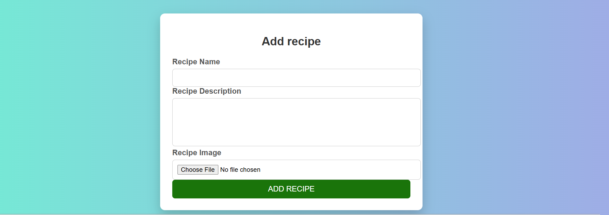
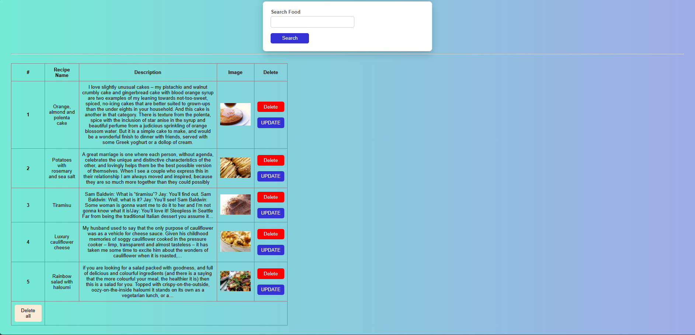
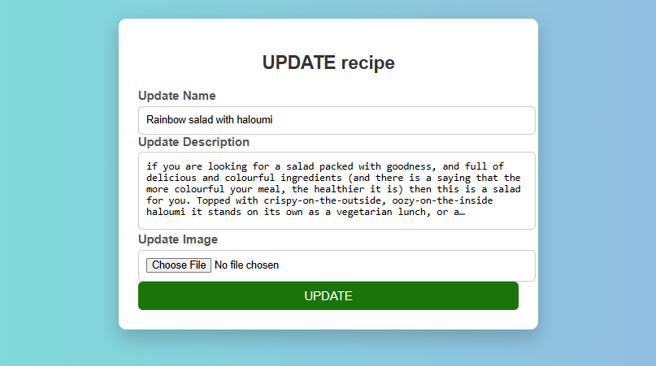

# 🍽️ Recipe Management System

A full-stack web application built using Django that allows users to create, manage, search, and organize recipes efficiently through a clean and intuitive interface.

---

## 📌 Overview

The Recipe Management System is a web-based application designed to simplify the process of storing and managing recipes. It demonstrates core backend development concepts using Django, including CRUD operations, database handling with Django ORM, and dynamic content rendering.

Users can add new recipes, search for existing ones, update details, and delete unwanted entries, making it a complete data management solution.

---

## ✨ Key Features

* 🔄 Full CRUD functionality (Create, Read, Update, Delete)
* 🔍 Search recipes by name
* 🧠 Backend powered by Django ORM
* 🖥️ Dynamic rendering using Django Templates
* 📋 Structured display of recipe data
* 💡 Simple and user-friendly interface

---

## 🛠️ Tech Stack

* **Backend:** Django (Python)
* **Frontend:** HTML, CSS 
* **Database:** SQLite
* **Version Control:** Git & GitHub

---

## ⚙️ Installation & Setup

### 1. Clone the repository

```id="p3k8tu"
git clone https://github.com/kamalmishra8929-gif/-Recipe-Management-System.git
```

### 2. Navigate to project directory

```id="d91k0l"
cd recipe-management
```

### 3. Create virtual environment (recommended)

```id="yq8c4t"
python -m venv venv
venv\Scripts\activate
```

### 4. Install dependencies

```id="d7lf1k"
pip install -r requirements.txt
```

### 5. Apply migrations

```id="h4o1kz"
python manage.py migrate
```

### 6. Run the server

```id="bn5qwx"
python manage.py runserver
```

### 7. Open in browser

```id="f5m3xo"
http://127.0.0.1:8000/
```

---

## 📷 Screenshots
 Home Page

**Recipe List




---

## 📁 Project Structure

```id="q9r2kp"
recipe-management/
│
├── app/                # Main Django app
├── templates/          # HTML templates
├── static/             # CSS files
├── screenshots/        # Images for README
├── manage.py
├── db.sqlite3
├── requirements.txt
├── .gitignore
└── README.md
```

---

## 🚀 Future Enhancements

* 🔐 User Authentication (Login/Signup)
* 🖼️ Image upload for recipes
* ❤️ Favorite/like recipes feature
* 🌐 REST API integration
* 🎨 Enhanced UI/UX design

---

## 💡 Learning Outcomes

* Hands-on experience with Django framework
* Implementation of CRUD operations
* Working with Django ORM and databases
* Template rendering and frontend integration
* Version control using Git and GitHub

---

## 👨‍💻 Author

**Kamal Mishra**

---

## ⭐ Support

If you like this project, consider giving it a ⭐ on GitHub!

---
