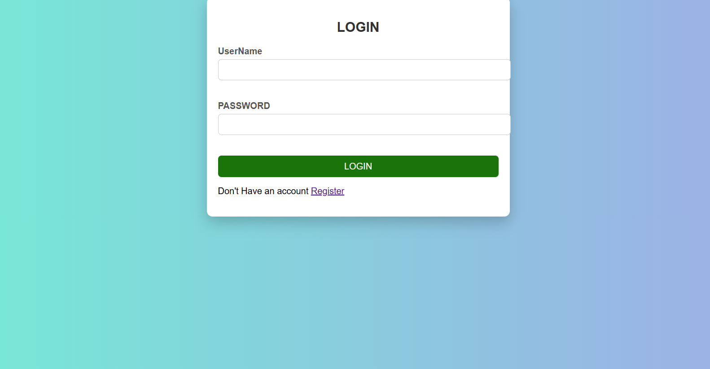
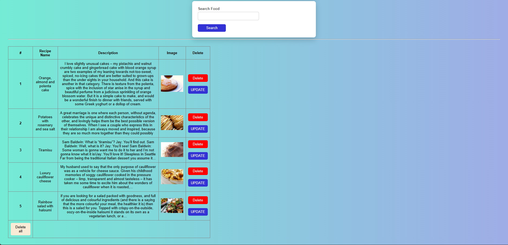
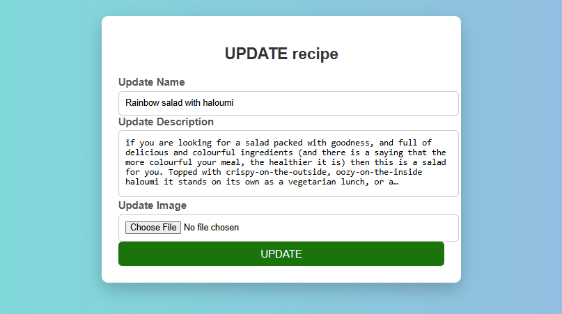

# 🍽️ Recipe Management System

A full-stack web application built using Django that allows users to create, manage, search, and organize recipes efficiently through a clean and intuitive interface.

---

## 📌 Overview

The Recipe Management System is a web-based application designed to simplify the process of storing and managing recipes. It demonstrates core backend development concepts using Django, including CRUD operations, database handling with Django ORM, and dynamic content rendering.

Users can add new recipes, search for existing ones, update details, and delete unwanted entries, making it a complete data management solution.

---

## ✨ Key Features

* 🔄 Full CRUD functionality (Create, Read, Update, Delete)
* 🔍 Search recipes by name
* 🔐 User Authentication (Register / Login / Logout)
* 👤 User-specific recipe ownership
* 🛡️ Role-based access control
* 👑 Superuser/Admin full access
* 🧠 Backend powered by Django ORM
* 🖥️ Dynamic rendering using Django Templates
* 🖼️ Image upload support for recipes
* 📋 Structured display of recipe data
* 💡 Clean and user-friendly interface

---
## 👥 User Roles & Permissions

### 🔹 Normal Users

* Register and login securely
* Add new recipes
* View all recipes
* Update/Delete only their own recipes
* Delete all of their own recipes

### 🔹 Admin / Superuser

* Access all recipes
* Update/Delete any recipe
* Delete all recipes
* Manage platform data

---
## 🛠️ Tech Stack

* **Backend:** Django (Python)
* **Frontend:** HTML, CSS
* **Database:** SQLite
* **Authentication:** Django Auth System
* **Version Control:** Git & GitHub

---

## ⚙️ Installation & Setup

### 1. Clone the repository

```id="p3k8tu"
git clone https://github.com/kamalmishra8929-gif/-Recipe-Management-System.git
```

### 2. Navigate to project directory

```id="d91k0l"
cd recipe-management
```

### 3. Create virtual environment (recommended)

```id="yq8c4t"
python -m venv venv
venv\Scripts\activate
```

### 4. Install dependencies

```id="d7lf1k"
pip install -r requirements.txt
```

### 5. Apply migrations

```id="h4o1kz"
python manage.py migrate
```

### 6. Run the server

```id="bn5qwx"
python manage.py runserver
```

### 7. Open in browser

```id="f5m3xo"
http://127.0.0.1:8000/
```

---

## 📷 Screenshots
 Login Page
 
 Home Page

**Recipe List




---

## 📁 Project Structure

recipe-management/
│
├── kamal/              # Main Django App
├── templates/          # HTML Templates
├── static/             # CSS / Images
├── media/              # Uploaded Recipe Images
├── migrations/         # Database Migrations
├── db.sqlite3
├── manage.py
├── requirements.txt
└── README.md
```

---

## 🚀 Future Enhancements

* 🔐 User Authentication (Login/Signup)
   1. User Registration
   2. Secure Password Hashing
   3. Login using Django Authentication
   4. Logout Session Handling
   5. Protected Routes with login_required
* 🖼️ Image upload for recipes
* ❤️ Favorite/like recipes feature
* 🌐 REST API integration
* 🎨 Enhanced UI/UX design

---
🧠 Backend Functionalities
Django Models & ORM
Query Filtering
User Ownership Validation
Search with icontains
Form Handling with POST Requests
File Upload Handling
Flash Messages Framework

---
🚀 Future Enhancements
❤️ Favorite Recipes Feature
📱 Responsive Mobile UI
🌐 Django REST API
📊 Admin Analytics Dashboard
📧 Email Verification
🔄 Password Reset
☁️ Cloud Image Storage
🔎 Category Filters

---

## 💡 Learning Outcomes

* Hands-on experience with Django Framework
* Authentication & Authorization
* CRUD Operations Implementation
* Role-Based Access Control
* Working with Django ORM
* File Upload Handling
* Template Rendering
* Secure User Session Management
* Git & GitHub Workflow

---

## 👨‍💻 Author

Kamal Mishra
Backend Developer | Django Enthusiast | Python Learner

---

## ⭐ Support

If you like this project, consider giving it a ⭐ on GitHub!

---
